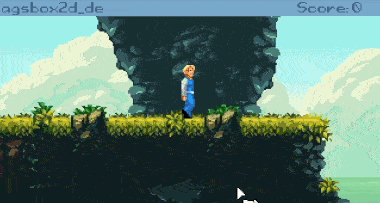

# agsbox2d

[](https://dev.azure.com/ericoporto/agsbox2d/_build/latest?definitionId=11&branchName=master)

AgsBox2D is a physics plugin for Adventure Game Studio that gives access to the Box2D library created by Erin Catto.
Because I never used Box2D directly before, I tried to make the API similar to Love physics module.



AgsBox2D is still in early development.

- [In development warning](#in-development-warning)
- [Usage example](#usage-example)
- [Script API](#script-api)
  * [AgsBox2D](#agsbox2d)
  * [Body](#body)
  * [World](#world)
  * [Shape](#shape)
  * [Fixture](#fixture)
- [Download agsbox2d](#download-agsbox2d)
- [Building agsbox2d](#building-agsbox2d)
- [License and Author](#license-and-author)

## In development warning

AgsBox2D is in development and you can reach uncommon bugs, like unstable load
from regular ags save. This plugin does support regulas AGS Save and Load, but
I can have forgotten something, so if you hit this, just [open an issue here](https://github.com/ericoporto/agsbox2d/issues/new).

Still, if you want to experiment with it and report your findings, this README
should prove itself useful and I appreciate any help in making this plugin work
well with AGS.

## Usage example

Below we will do a very simple example that creates a ground, and adds a
ball and a box. The ball is controlled by keyboard arrows.

```AGS Script
// room script file
World* world;
Overlay* ov;

struct Physical {
  Body* body;
  Shape* shape;
  Fixture* fixture;
};

Physical ground;
Physical ball;

function room_Load()
{
  if(world == null){
    AgsBox2D.SetMeter(32.0);
    world = AgsBox2D.CreateWorld(0.0, 9.8*AgsBox2D.GetMeter());
    
    ground.body = AgsBox2D.CreateBody(world, 160.0, 160.0, eBodyStatic);
    ground.shape = AgsBox2D.CreateRectangleShape(320.0, 40.0);
    ground.fixture = AgsBox2D.CreateFixture(ground.body, ground.shape);

    ball.body = AgsBox2D.CreateBody(world, 160.0, 40.0, eBodyDynamic);
    ball.shape = AgsBox2D.CreateCircleShape(20.0);
    ball.fixture = AgsBox2D.CreateFixture(ball.body, ball.shape, 1.0); 
    ball.fixture.Restitution = 0.5;
    
    AgsBox2D.CreateFixture(AgsBox2D.CreateBody(world, 80.0, 60.0, eBodyDynamic), 
                           AgsBox2D.CreateRectangleShape(30.0, 20.0), 5.0);
  }
}

function room_RepExec()
{
  if(IsKeyPressed(eKeyLeftArrow)) ball.body.ApplyForce(-500.0, 0.0);
  if(IsKeyPressed(eKeyRightArrow)) ball.body.ApplyForce(500.0, 0.0);
  if(IsKeyPressed(eKeyUpArrow) && ball.body.IsTouching(ground.body)){
    ball.body.ApplyForce(0.0, -6000.0);
    ball.body.SetLinearVelocity(0.0, 0.0);
  }
  
  if(ov!=null && ov.Valid) ov.Remove();  
  ov = Overlay.CreateGraphical(0, 0, world.GetDebugSprite(), true);
  
  world.Step(1.0/IntToFloat(GetGameSpeed()), 8, 3);
}
```

Check [agsbox2d_demo](https://github.com/ericoporto/agsbox2d/tree/master/agsbox2d_demo) AGS Game project by loading it on AGS!

## Script API

### AgsBox2D

#### `void AgsBox2D.SetMeter(float meter)`

Sets how many pixels equals to a meter. Default is 32 pixels per meter.

***Do this only once, before using any other functions, it doesn't apply retroactively***

You want the size of your moving objects roughly between 0.1 and 10 meters.

For the default 32px this enables objects between 3 and 320 pixels, so this
usually needs to scale along with your game resolution and character size.

Internally, Box2D uses Meter, Kilograms and Seconds as it's main units.

#### `float AgsBox2D.GetMeter()`

Get's previously passed meter in pixels.

#### `World* AgsBox2D.CreateWorld(float gravityX, float gravityY)`

Creates a World object, this should be done before creating bodies. 

A positive gravityY is directed to ground, and a negative gravityY is directed 
upwards. 

Similarly, a positive gravityX is directed to right and a negative gravityX is 
directed to left.

#### `Body* AgsBox2D.CreateBody(World* world,  float x, float y, BodyType bodytype)`

Creates a body object in the world, at specified x and y positions. 
These positions correspond to the center of the body. 

The bodytype can be any of the types below:

- `eBodyStatic` : An object that does not move under simulation, usually the 
ground in a platformer is a static body. It doesn't collide with other static
or kinematic bodies. A static body has zero velocity. 

- `eBodyDynamic` : A fully simulated body, can collide with all body type,
 this body moves according to forces. It always has finite non-zero mass.

- `eBodyKinematic` : A kinematic body moves according it's velocity, it doesn't
move according to forces. A Kinematic body behaves as if it has infinite mass. 
It doesn't collide with other Kinematic bodies or with static bodies.

Any bodytype can be moved by user input, but you have to specific code the behavior
in AGS.

You don't need to keep the returned pointer if you aren't going to need to 
access this body anymore, since the world will hold it, but you will be unable
to destroy it unless the world is destroyed.

The specifics on a body form and mass are defined by using a Shape and Fixture.

#### `void AgsBox2D.DestroyBody(World* world,  Body* body)`

Removes a body from the world, and marks it with the property IsDestroyed true.

#### `Shape* AgsBox2D.CreateRectangleShape(float w,  float h,  float x=0, float y=0)`

Creates a RectangleShape with Width w and Height h, and returns a Shape object. 

You can also change it's relative center which will be mapped to the body center.
An x of 0.0 and y of 0.0, which are defaults, maps to the shape center.

#### `Shape* AgsBox2D.CreateCircleShape(float radius,  float x=0, float y=0)`

Creates a Circle shape, and similar to RectangleShape, you can also translate
it's center.

#### `Fixture* AgsBox2D.CreateFixture(Body* body, Shape* shape, float density=0)`

Creates a Fixture, and attachs a body a shape, and specifies a density. 

You should always pass finite non-zero densities for dynamic bodies.

You don't need to keep the pointer to the shape attached to a body through a 
fixture, since the body will hold a copy of the shape. Similarly, you also
don't need to keep a pointer to the fixture, because the body will hold it too.

### Body

#### `int Body.X`

The X position property of a body as integer. 

Avoid setting this property directly. Bodies coordinates are actually float 
values in the simulation, this is provided as convenience.

#### `int Body.Y`

The Y position property of a body as integer. 

Avoid setting this property directly. Bodies coordinates are actually float 
values in the simulation, this is provided as convenience.

#### `float Body.fX`

The X position property of a body as float.

#### `float Body.fY`

The Y position property of a body as float. 

#### `float Body.Angle`

The Body Angle property. AGS can't easily rotate Sprites so avoid using angles
with bodies that you expect to map directly in someway to screen sprites.

#### `bool Body.FixedRotation`

By default, bodies are created with FixedRotation set to true. 

A body with FixedRotation set to true does not rotate, causing it's rotational 
inertia and it's inverse to be set to zero.

#### `bool Body.Bullet`

By default, bodies are created with Bullet set to false. 

Set bullet to true when the body has a small shape and moves really fast, 
this will prevent the body from having wrong collisions with thin bodies.

#### `readonly bool Body.IsDestroyed`

Returns true if it's destroyed by `AgsBox2D.DestroyBody()`.

#### `float Body.LinearDamping`

The LinearDamping property of a body. Damping occurs independently from contact
and is different than friction. Normally  the value for damping is between 
`0.0` and `0.1`.

#### `float Body.AngularDamping`

The AngularDamping property of a body, the angular drag, also happens 
independently from contact.

#### `float Body.AngularVelocity`

The AngularVelocity property of a body.

#### `float Body.Inertia`

Rotational Inertia, body's resistance to changes in angular velocity.

#### `readonly float Body.LinearVelocityX`

Gets the X vector from the body's Linear Velocity.

#### `readonly float Body.LinearVelocityY`

Gets the Y vector from the body's Linear Velocity.

#### `void Body.SetLinearVelocity(float fx, float fy)`

Set's the body LinearVelocity vector.

#### `void Body.ApplyForce(float fx, float fy)`

Applies a force on a body from it's center `0.0, 0.0` to the specified `fx, fy`
direction.

#### `void Body.ApplyAngularImpulse(float impulseIntensity)`

Applies an angular impulse on the body.

#### `void Body.ApplyLinearImpulse(float intensity_x, float intensity_y)`

Applies an impulse from the body center with the specified vector.

#### `void Body.ApplyTorque(float torque)`

Applies a torque on the body. Positive values are counter clockwise.

#### `bool Body.IsTouching(Body* otherBody)`

Returns true when a body is in contact (being touched) by other body.
This function only evaluates at the current time, so prefer using it for
resting states.

### World

The world holds all the information needed for the physics simulation. Once a
world is destroyed, the previous pointers (Bodies, Fixtures, ...) will be of no
use and you will need to recreate any objects you need in the new world.

#### `void World.Step(float dt, int velocityIteractions=8, int positionIteractions=3)`

Advances a step in the World physics simulation of `dt` seconds. 

Because AGS uses fixed game steps, a good value is  `dt = 1.0/IntToFloat(GetGameSpeed())`.

velocityIteractions and positionIteractions relates to how Box2D simulates the
world, so for information on these values I recommend looking into Box2D own documentation.

#### `int World.GetDebugSprite(int camera_x=0, int camera_y=0)`

Returns a sprite of the size of the screen with the objects in the world drawn on it.

A common usage is to create a GUI of the size of the screen and set the background
graphic of it with the sprite this function outputs.

You can pass a camera x and y value to scroll the camera on the world.

### Shape

#### `ShapeRectangle* Shape.AsRectangle`

If the shape is a ShapeRectangle, it returns it. Otherwise, it returns `null`.
You should not hold pointers to it, and instead access it directly like 
`myshape.AsRectangle.Width` as needed.

#### `ShapeCircle* Shape.AsCircle`

If the shape is a ShapeCircle, it returns it. Otherwise, it returns `null`.
You should not hold pointers to it, and instead access it directly like 
`myshape.AsCircle.Radius` as needed.

### Fixture

Fixtures are used when linking a shape to an object and assigning it's density.

#### `float Fixture.Density`

Density is used to compute the mass of the linked body. It's preferable to use
similar densities to all your fixtures, because this will improve the 
simulation.

#### `float Fixture.Friction`

Friction is used to make objects slide along each other realistically.

It's usually a value between `0.0` and `1.0`, but can be any non-negative value.

Box2D uses the square root of the multiplication of two contacting fixtures to 
calculate the contact friction. This means if one fixture has `0.0` friction, 
the contact will have no friction.

#### `float Fixture.Restitution`

Restitution is used to make objects bounce, and is usually a value between 
`0.0` and `1.0`. A value of `0.0` means the object won't bounce, and a value
of `1.0` means the object velocity will be exactly reflected.

## Download AgsBox2D

This plugin is available as `agsbox2d.dll` under [assets, in the latest release](https://github.com/ericoporto/agsbox2d/releases/latest/),
for usage with Windows and the AGS Editor. You can also find it there built 
for Linux as `libagsbox2d.so` and for MacOS as `libagsbox2d.dylib`.

## Building agsbox2d 

AgsBox2D both Makefile and the VS Solution file, expects to find [Adventure Game Studio source code](https://github.com/adventuregamestudio/ags)
in a folder `../ags/`. After you do this, you need to clone this source code.

```
  ~/git/ags/
  ~/git/agsbox2d/
```

Navigate then to the directory where you cloned this repository.

On Windows, you can load the solution on the root of it's directory and load 
it on Visual Studio. It should work with VS 2015, 2017 and 2019. You will need
v140 tools (VS should promptly warn you to install if you don't have it).
The dll provided by Release Win32 builds is the one you should build to use
with an AGS Game at the time of this writing.

On Linux and MacOS, navigate to `agsbox2d/` inside the directory and type `make`.

## License and Author

AgsBox2D is made by Érico Vieira Porto provided with Z-Lib [LICENSE](LICENSE).

Box2D itself is made by Erin Catto and is provided with a Z-Lib [LICENSE](Box2D/Box2D/LICENSE) too.

Magic Cliffs background used on the demo is made by [ansimuz](https://opengameart.org/content/magic-cliffs-environment) and is available as CC-BY 3.0.
